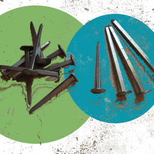
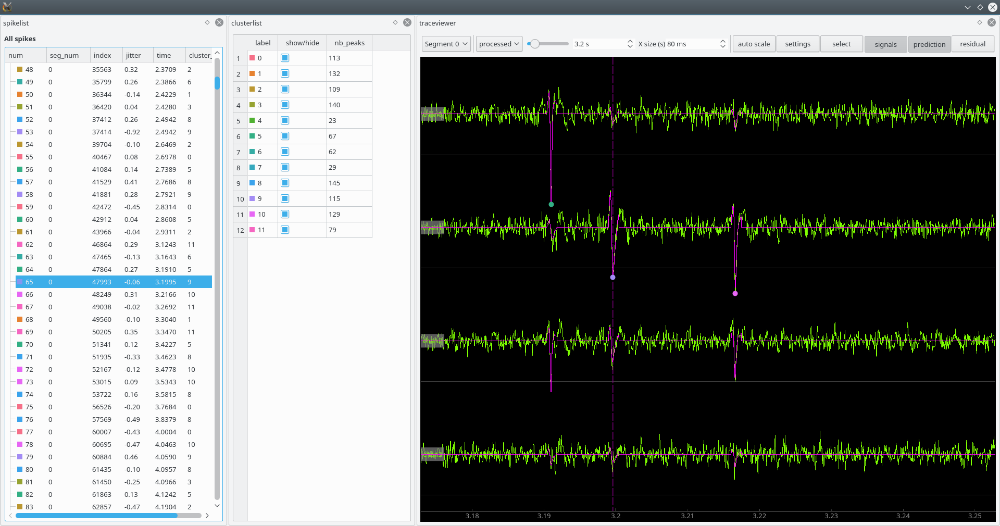

# trisdesclous : spike sorting with [french touch](https://fr.wikipedia.org/wiki/French_touch_(informatique)).

Authors: Christophe Pouzat and Samuel Garcia

**tris des clous** is a very dishonest translation of **spike sorting** to french.

Pronouce it [tree day clue] for english speaker.

Documentation is here: http://tridesclous.readthedocs.io/

This module provide some functions and examples of spike sorting.
It is our material to teach good practices in spike sorting technics.

You can also use it for real data of course. 
The forest of spike sorting tools is dense and *tridesclous* is a new tree.
Be courious and try it.

*tridesclous* is a complete rewrite of our old (and unsuccessful) tools (SpikeOmatic, OpenElectrophy, ...)
with up-to-date (in 2017) python modules to simplify our codes.

tridesclous:
  * should make easy to leave a mark of your spike sorting process in
    a jupyter notebook.
  * offer a simple UI written in Qt for interactive exploration.
  * can be used for online spikesorting with pyacq.

In short, *tridesclous* force you to write a script for spike sorting but 
you also benefit of a simple UI for offline spike sorting (and online soon).

Bonus:
  * tridesclous is quite fast. For a tetrode dataset, you can expect X30 speedup over real time on a simple laptop.
  * some pieces of algorithm of written both in pure python (numpy/scipy/...) and OpenCL (filter, peak detetion, ...). So *tridesclous* should be efficient for large array (>=64 channel) soon.
  * each piece of the algorithm is written with chunk by chunk in mind. So the offline *tridesclous* is not agressive for memory.
  * tridesclous used [neo](https://github.com/NeuralEnsemble/python-neo) for reading dataset. So many format are available (Raw, Blackrock, Neuralynx, Plexon, Spike2, Tdt, ...)
  * tridesclous is open source and based on true opensource stack.
  * some datasets are available for testing it now here https://github.com/tridesclous/tridesclous_datasets

# Installation

http://tridesclous.readthedocs.io/en/latest/installation.html

# Launch

http://tridesclous.readthedocs.io/en/latest/launch.html

# Screenshots

## Offline Catalogue Window

## offline Peeler Window

## Online Peeler in a pyacq.Node

